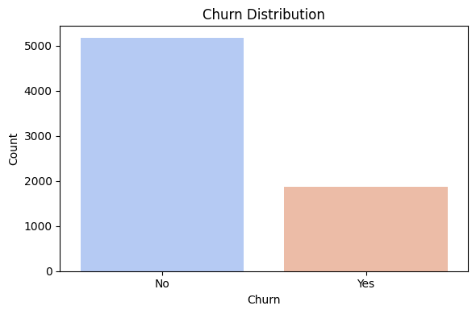
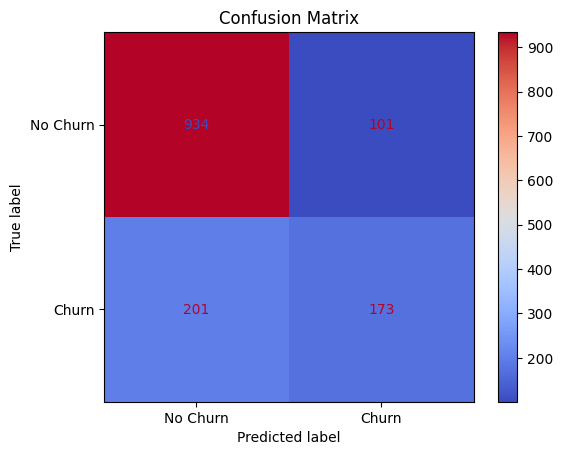
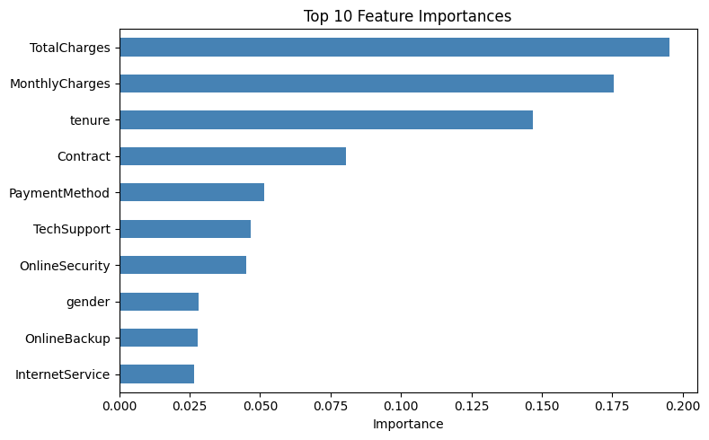

# Customer Churn Prediction with Random Forest

Predicts whether a telecom customer will **churn** (cancel their service) from their demographics, subscribed services, contract type and billing details, using a Random Forest classifier on the [IBM Telco Customer Churn dataset](https://www.kaggle.com/datasets/blastchar/telco-customer-churn).

## What it does

1. Loads the Telco customer data (one row per customer, ~7,000 customers) and prints the churn class balance.
2. Plots the churn distribution (how many customers stayed vs. left).
3. Cleans `TotalCharges`, which is stored as text because a few new customers have a blank value — converts it to numbers and fills the blanks with the median.
4. **Label-encodes** every categorical column (gender, contract type, payment method, the various services…) and the `Churn` target into integers.
5. Splits the data into an 80% training set and a 20% test set, **stratified** so both keep the same churn ratio.
6. Standardizes the features (scaler fitted on training data only).
7. Trains a Random Forest classifier and reports accuracy plus precision, recall and F1 for each class.
8. Plots a confusion matrix and the top 10 most important features.

## Concepts covered

- **Binary classification** — the target is Yes/No, so the model outputs one of two classes for each customer.
- **Cleaning numbers stored as text** — `pd.to_numeric(..., errors="coerce")` turns unparseable entries (here, blank strings) into `NaN` so they can be found and filled instead of crashing the model.
- **Label encoding** — tree-based models need numbers, not strings. Label encoding maps each category to an integer (e.g. `Month-to-month → 0`, `One year → 1`, `Two year → 2`). That's fine for trees, which split on thresholds; for linear models, one-hot encoding is usually better because it doesn't imply an order between categories.
- **Stratified splitting** — only about a quarter of customers churn. Stratifying keeps that ratio identical in the training and test sets, so the test score isn't skewed by an unlucky split.
- **Fit on train, transform on test** — the scaler learns its mean and standard deviation from the training data only, so no information about the test set leaks into training. (Random Forests don't actually need scaled features; scaling is kept as an option via `scale_features` so the pipeline can be reused with scale-sensitive models.)
- **Random Forest** — an ensemble of decision trees, each trained on a random sample of rows and features, whose votes are combined. It handles mixed feature types well and gives a feature-importance score for free.
- **Why accuracy isn't enough** — with ~73% of customers not churning, a model that always says "No churn" would already score ~73% accuracy. Recall on the churn class (how many actual churners the model catches) and the confusion matrix show whether the model is genuinely finding churners.

## Project structure

```
main.py      # full pipeline, organized into functions (config, data loading,
              # cleaning, label encoding, stratified split, scaling,
              # Random Forest training, evaluation, plotting)
README.md    # this file
```

The code is organized into small, named functions driven by a `PipelineConfig` dataclass — `load_data`, `clean_total_charges`, `encode_categoricals`, `split_data`, `scale_features`, `train_random_forest`, `evaluate_model`, `feature_importances`, `plot_churn_distribution`, `plot_confusion_matrix`, `plot_feature_importances` — tied together by `run_pipeline()`.

Settings such as the file path, test size, random seed and number of trees live in `PipelineConfig`, so you can experiment without touching the pipeline code:

```python
from main import PipelineConfig, run_pipeline

run_pipeline(PipelineConfig(n_estimators=300, test_size=0.25))
```

## Requirements

```
pandas
matplotlib
seaborn
scikit-learn
```

Install with:

```bash
pip install pandas matplotlib seaborn scikit-learn
```

## How to run

Download the dataset from Kaggle, save it as `Telco-Customer-Churn.csv` in the same directory as `main.py`, then:

```bash
python main.py
```

## Sample output

Running the script prints the class balance, the test accuracy, a per-class classification report and the top 10 features, then displays three charts.

**Churn distribution**



**Confusion matrix**



**Top 10 feature importances**



## A note on the results

On this dataset a default Random Forest typically lands around 80% accuracy — only a few points above the ~73% you'd get by predicting "No churn" for everyone. The confusion matrix tells the more useful story: the model is good at recognising customers who stay, but misses a large share of the customers who actually leave, because churners are the minority class. For a real retention campaign, catching churners matters more than overall accuracy, so natural next steps are balancing the classes (`class_weight="balanced"` or oversampling with SMOTE), lowering the decision threshold on predicted churn probability, tuning hyperparameters with cross-validation, and comparing against gradient-boosting models.

## References

- [IBM Telco Customer Churn dataset (Kaggle)](https://www.kaggle.com/datasets/blastchar/telco-customer-churn)
- [scikit-learn — RandomForestClassifier](https://scikit-learn.org/stable/modules/generated/sklearn.ensemble.RandomForestClassifier.html)
- [GeeksforGeeks — Machine Learning Projects](https://www.geeksforgeeks.org/machine-learning/machine-learning-projects/) — used as a general reference/inspiration while working on this project.

---
*This is a personal learning project. Predictions from this model should not be used for real customer decisions without further validation.*
