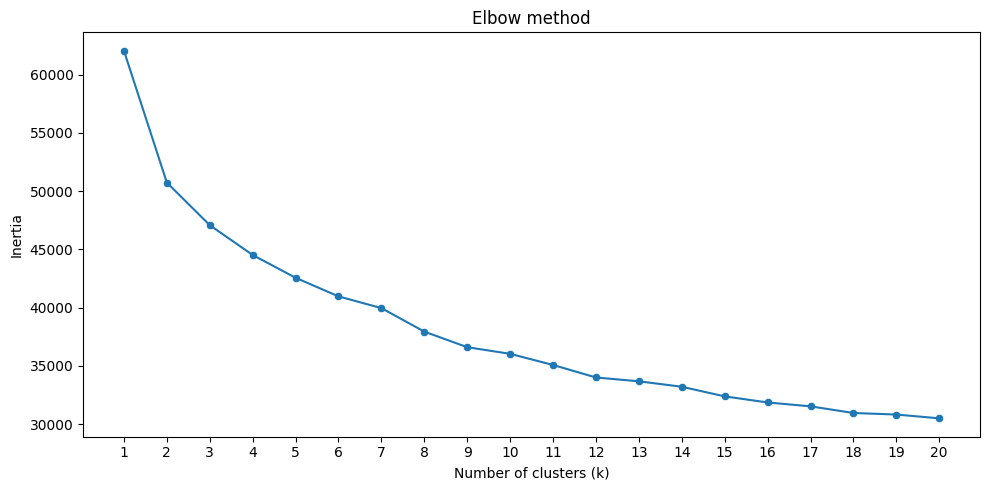
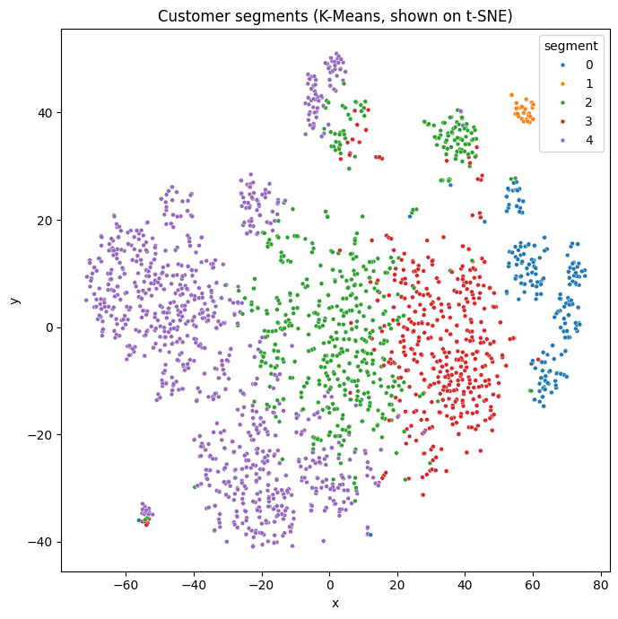

# Customer Segmentation with K-Means Clustering

Groups customers into **segments** with similar demographics, spending habits and campaign responses, using K-Means clustering on a customer personality / marketing dataset, and visualizes the segments in two dimensions with t-SNE.

## What it does

1. Loads the customer dataset (`new.csv`): one row per customer, with birth year, education, marital status, income, children at home, enrolment date, recency, spending per product category, purchases per channel and responses to marketing campaigns.
2. Reports and removes rows with missing values (a small number of customers have no recorded income).
3. Splits the enrolment date `Dt_Customer` (dd-mm-yyyy) into numeric `day`, `month` and `year` columns.
4. Drops columns that carry no information about the customer: `ID` (a row number) and `Z_CostContact` / `Z_Revenue` (the same value in every row).
5. Plots customer counts by education and marital status, and how each relates to campaign `Response`.
6. **Label-encodes** the categorical columns and plots a heatmap of highly correlated feature pairs.
7. **Standardizes** all features so each one counts equally in the distance calculation.
8. Projects the customers into 2-D with **t-SNE** to see whether natural groups exist.
9. Runs K-Means for k = 1 to 20 and plots the **elbow curve** of inertia against k.
10. Fits the final K-Means model with 5 clusters, colours the t-SNE plot by segment, and prints each segment's size and average profile (income, age, children, spending, purchase channels).

## Concepts covered

- **Unsupervised learning** — there is no target column; the model finds structure in the data on its own. The output is a segment label for each customer, which a marketing team can then interpret and act on.
- **K-Means clustering** — K-Means places k centres and repeatedly assigns each customer to the nearest centre, then moves each centre to the mean of its customers, until nothing changes. `k-means++` picks smart starting centres so the result is more stable.
- **Why scaling matters for clustering** — K-Means measures similarity with Euclidean distance. Without scaling, a column like `Income` (tens of thousands) would swamp columns like `Kidhome` (0–2), and the clusters would effectively be income bands. Standardizing gives every feature mean 0 and standard deviation 1.
- **Dropping identifiers and constants** — an `ID` column is just a row number; left in, it would make "customers with similar IDs" look alike. Constant columns add nothing but noise.
- **The elbow method** — inertia (the total squared distance from each customer to its centre) always falls as k grows. The "elbow", where adding more clusters stops giving a big improvement, is a reasonable choice for k.
- **t-SNE** — a technique that squeezes many dimensions into 2 while keeping customers who are similar close together. It is for *visualization only*: distances between far-apart groups on a t-SNE plot aren't meaningful, and the clusters themselves are computed on the full feature set.
- **Segment profiling** — a cluster number means nothing on its own. Averaging key columns per segment turns "segment 3" into something like "younger, high-income customers who buy mostly online".

## Project structure

```
main.py      # full pipeline, organized into functions (config, data loading,
              # missing values, date features, encoding, scaling, t-SNE,
              # elbow method, K-Means, segment profiling, plotting)
README.md    # this file
```

The code is organized into small, named functions driven by a `PipelineConfig` dataclass — `load_data`, `drop_missing`, `split_enrolment_date`, `drop_unused_columns`, `encode_categoricals`, `prepare_features`, `embed_tsne`, `elbow_inertias`, `fit_segments`, `profile_segments`, plus the plotting functions — tied together by `run_pipeline()`.

Settings such as the number of clusters, the elbow range and which columns to profile live in `PipelineConfig`, so you can experiment without touching the pipeline code:

```python
from main import PipelineConfig, run_pipeline

run_pipeline(PipelineConfig(n_clusters=4, max_clusters=10))
```

## Requirements

```
pandas
matplotlib
seaborn
scikit-learn
```

Install with:

```bash
pip install pandas matplotlib seaborn scikit-learn
```

## How to run

Place the dataset (`new.csv`, the Customer Personality Analysis marketing dataset with a `Dt_Customer` column in dd-mm-yyyy format) in the same directory as `main.py`, then:

```bash
python main.py
```

## Sample output

Running the script prints the missing-value report, the categorical columns, the number of customers in each segment and a table of segment profiles, then displays the charts.

**Elbow method**



**Customer segments on the t-SNE projection**



## A note on the results

Customer data rarely falls into neatly separated groups, so the elbow curve usually bends gradually rather than at one sharp point. Five clusters is a judgement call, a balance between segments distinct enough to be useful and few enough for a marketing team to act on. The segment profiles are the real output: look for differences in income, number of children, total spending and preferred purchase channel to give each segment a name.

The t-SNE plot is a helpful sanity check but shouldn't be over-read. K-Means works on the full standardized feature set, so segments that overlap in 2-D can still be well separated in the original space. Natural next steps would be checking the choice of k with silhouette scores, combining the spending columns into a single "total spend" feature, using one-hot encoding instead of label encoding for education and marital status, or trying other clustering methods such as Gaussian Mixture Models or DBSCAN.

## References

- [Customer Personality Analysis dataset (Kaggle)](https://www.kaggle.com/datasets/imakash3011/customer-personality-analysis)
- [scikit-learn — KMeans](https://scikit-learn.org/stable/modules/generated/sklearn.cluster.KMeans.html)
- [scikit-learn — TSNE](https://scikit-learn.org/stable/modules/generated/sklearn.manifold.TSNE.html)
- [GeeksforGeeks — Machine Learning Projects](https://www.geeksforgeeks.org/machine-learning/machine-learning-projects/) — used as a general reference/inspiration while working on this project.

---
*This is a personal learning project. Segments from this model should be reviewed before being used for real marketing decisions.*
