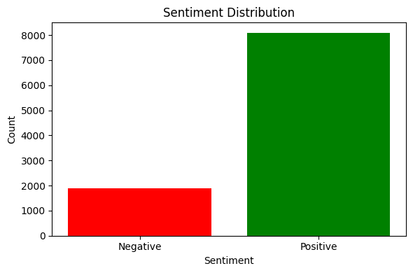
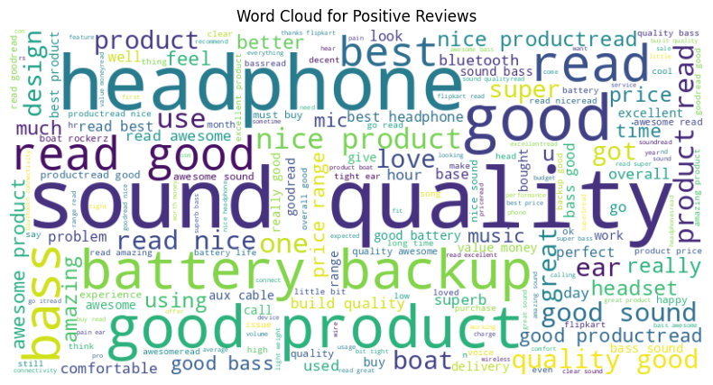
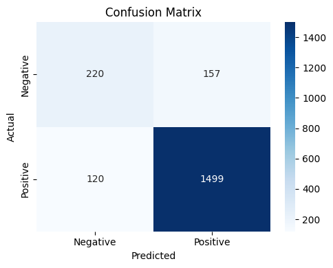

# Flipkart Review Sentiment Analysis

Classifies Flipkart product reviews as **positive** or **negative** from their text. It uses TF-IDF features and a Decision Tree classifier, with labels taken from each review's star rating.

## What it does

1. Loads the Flipkart reviews (`flipkart_data.csv`, with `review` text and a 1–5 star `rating`) and drops rows with missing text or rating.
2. Labels each review: **positive (1)** if rated 4 or 5 stars, **negative (0)** if rated 1–3.
3. Cleans the text: lower-cases it, removes punctuation, and removes English stopwords from NLTK's list while **keeping negation words** such as *not*, *no* and *never*.
4. Plots the sentiment distribution, plus word clouds for positive and negative reviews.
5. Converts the cleaned text into **TF-IDF** features (top 5,000 words).
6. Splits the data into 80% training and 20% test, **stratified** so both keep the same positive/negative ratio.
7. Trains a Decision Tree classifier and reports accuracy, a majority-class baseline, and per-class precision, recall and F1.
8. Plots a confusion matrix.

## Concepts covered

- **Labels from ratings** — instead of hand-labelling reviews, the star rating serves as a ready-made label. The 4-star cut-off is a choice. 3-star reviews are often mixed, and counting them as negative is one reasonable option among several.
- **Text cleaning** — lower-casing makes "Good" and "good" the same word, and stripping punctuation makes "good." and "good" the same word. Without these steps the model would learn several versions of every word.
- **Stopwords and why negations matter** — stopwords are very common words (*the*, *is*, *and*) that carry little meaning, so removing them reduces noise. But NLTK's list also contains *not*, *no* and *don't*. Removing those turns "not good" into "good" and flips the sentiment, so this project keeps them (`keep_negations=True`).
- **TF-IDF** — Term Frequency × Inverse Document Frequency gives each word a weight that is high when the word is frequent in *this* review but rare across *all* reviews. Common filler words get low weights and distinctive words like *defective* or *excellent* get high ones.
- **Decision Trees on text** — the tree learns rules such as "if the weight of *worst* is above 0.1, predict negative". The rules are easy to interpret, but a single tree can overfit when there are thousands of word features.
- **Imbalanced classes** — product reviews are usually mostly positive. A model that always says "positive" can score high accuracy while never catching a complaint, so the script prints that majority-class baseline and per-class recall next to accuracy.
- **Word clouds** — a quick visual check of which words dominate each class. They help with exploration but aren't a measure of model quality.

## Project structure

```
main.py      # full pipeline, organized into functions (config, loading,
              # labelling, text cleaning, TF-IDF, stratified split,
              # Decision Tree training, evaluation, plotting)
README.md    # this file
```

The code is organized into small, named functions driven by a `PipelineConfig` dataclass: `load_data`, `build_stopwords`, `clean_text`, `preprocess`, `vectorize`, `split_data`, `train_decision_tree`, `evaluate_model`, `plot_sentiment_distribution`, `plot_wordcloud`, `plot_confusion_matrix`. `run_pipeline()` runs them in order.

Settings such as the positive-rating cut-off, the vocabulary size and whether to keep negation words live in `PipelineConfig`, so you can experiment without touching the pipeline code:

```python
from main import PipelineConfig, run_pipeline

run_pipeline(PipelineConfig(positive_threshold=3, max_features=10000))
```

## Requirements

```
pandas
matplotlib
seaborn
scikit-learn
nltk
wordcloud
```

Install with:

```bash
pip install pandas matplotlib seaborn scikit-learn nltk wordcloud
```

The NLTK stopword list is downloaded automatically the first time the script runs.

## How to run

Place `flipkart_data.csv` (with `review` and `rating` columns) in the same directory as `main.py`, then:

```bash
python main.py
```

## Sample output

Running the script prints the sentiment counts, the train/test sizes, the accuracy next to the majority-class baseline, and a classification report, then displays the charts.

**Sentiment distribution**



**Word cloud for positive reviews**



**Confusion matrix**



## A note on the results

Short product reviews are a fairly easy sentiment task, because words like *good*, *nice*, *worst* and *waste* carry most of the signal. So a Decision Tree on TF-IDF features usually scores well above the majority-class baseline. Compare the accuracy with that baseline and check the **negative-class recall** in the classification report. That number shows how many real complaints the model actually catches, which is usually what a business cares about most.

A single Decision Tree tends to overfit thousands of sparse word features. Natural next steps would be:

- trying Logistic Regression, Linear SVM or Naive Bayes, which are standard strong baselines for TF-IDF text;
- adding word pairs (`ngram_range=(1, 2)`) so phrases like *"not worth"* become features;
- treating 3-star reviews as a separate neutral class or leaving them out;
- balancing the classes with `class_weight="balanced"`.

## References

- [scikit-learn — TfidfVectorizer](https://scikit-learn.org/stable/modules/generated/sklearn.feature_extraction.text.TfidfVectorizer.html)
- [NLTK — stopwords corpus](https://www.nltk.org/nltk_data/)
- [GeeksforGeeks — Machine Learning Projects](https://www.geeksforgeeks.org/machine-learning/machine-learning-projects/), used as a general reference/inspiration while working on this project.

---
*This is a personal learning project for practising text classification.*
