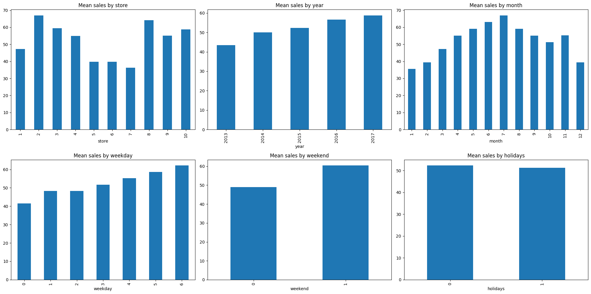
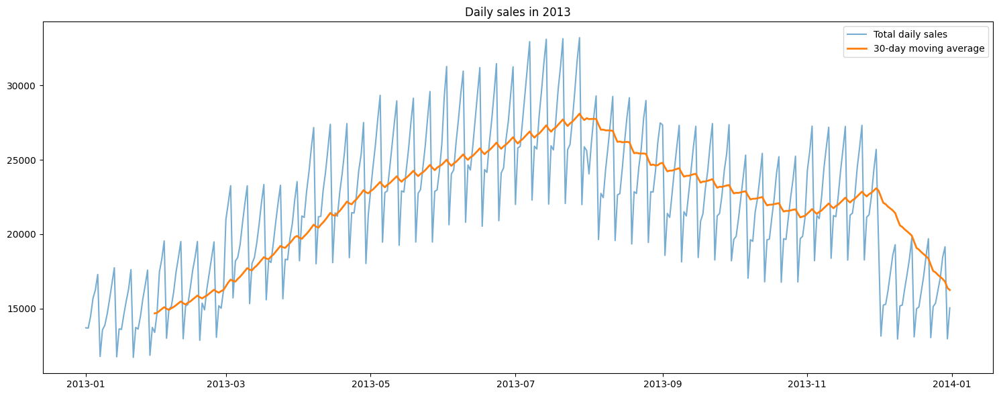

# Inventory Demand Forecasting with Machine Learning

Predicts **daily unit sales for each store–item pair** from calendar features alone (store, item, month, day, weekday, weekend, public holidays), and compares four regression models — Linear Regression, XGBoost, Lasso and Ridge — to see which best captures demand patterns.

## What it does

1. Loads five years of daily sales (2013–2017) for 50 items across 10 stores — 913,000 rows of `date`, `store`, `item`, `sales` (`train.csv`).
2. Engineers features from the date:
   - `month`, `day`, `weekday` (Mon = 0 … Sun = 6) and a `weekend` flag,
   - a `holidays` flag for public holidays (India by default, via the `holidays` package),
   - `m1` / `m2` — a sine/cosine encoding of the month.
3. Explores the data with charts: mean sales by store, year, month, weekday, weekend and holiday; mean sales by day of month; total daily sales for 2013 with a 30-day moving average; the sales distribution; and a heatmap of highly correlated features.
4. Removes extreme outliers (rows with `sales` ≥ 140).
5. Drops `year` from the features and makes a random 95% / 5% train/validation split.
6. Standardizes the features (scaler fitted on training data only).
7. Trains Linear Regression, XGBoost, Lasso and Ridge, and compares their training and validation **Mean Absolute Error (MAE)**.

## Concepts covered

- **Feature engineering from dates** — a raw date string is useless to a model, but the patterns hidden in it (weekday vs. weekend, month of year, holidays) are what drive retail demand. Splitting the date into parts turns that hidden structure into usable numeric features.
- **Cyclical encoding** — as a plain number, month 12 looks far from month 1, even though December and January are neighbours. Mapping the month onto a circle with `sin` and `cos` (`m1`, `m2`) keeps that closeness, which helps models that treat features as distances.
- **Holiday features** — demand often shifts around public holidays. `holidays.country_holidays()` provides the official calendar for a country, so the flag is built from data rather than a hand-typed list.
- **Moving averages** — a 30-day simple moving average smooths day-to-day noise so the underlying trend and seasonality are visible.
- **Outlier removal** — a small number of very high sales values can pull a regression line toward them. Capping the target at 140 removes those rare extremes before training.
- **Linear vs. tree-based models** — Linear Regression, Ridge (L2 penalty) and Lasso (L1 penalty) can only add up weighted features in a straight line. XGBoost builds many decision trees in sequence, so it can learn interactions such as "item 15 sells much more at store 2 on weekends" — which is exactly what demand data is full of.
- **MAE** — Mean Absolute Error is the average miss in units sold, so it reads directly: an MAE of 7 means the forecast is off by about 7 units per store, item and day on average.

## Project structure

```
main.py      # full pipeline, organized into functions (config, data loading,
              # date features, holiday flag, cyclical month, EDA plots,
              # outlier removal, split, scaling, model training, comparison)
README.md    # this file
```

The code is organized into small, named functions driven by a `PipelineConfig` dataclass — `load_data`, `add_date_parts`, `add_holiday_flag`, `add_cyclical_month`, `engineer_features`, `remove_outliers`, `split_data`, `scale_features`, `get_models`, `train_and_compare`, plus five plotting functions — tied together by `run_pipeline()`.

Settings such as the holiday country, outlier threshold, validation size and random seed live in `PipelineConfig`, so you can experiment without touching the pipeline code:

```python
from main import PipelineConfig, run_pipeline

run_pipeline(PipelineConfig(holiday_country="US", outlier_threshold=180))
```

## Requirements

```
numpy
pandas
matplotlib
seaborn
scikit-learn
xgboost
holidays
```

Install with:

```bash
pip install numpy pandas matplotlib seaborn scikit-learn xgboost holidays
```

## How to run

Download `train.csv` from the Kaggle [Store Item Demand Forecasting Challenge](https://www.kaggle.com/c/demand-forecasting-kernels-only/data) (columns `date`, `store`, `item`, `sales`), place it in the same directory as `main.py`, then:

```bash
python main.py
```

## Sample output

Running the script prints dataset statistics, the number of outliers removed, the features used and a model comparison table, then displays the exploratory charts.

**Mean sales by store, year, month, weekday, weekend and holiday**



**Daily sales in 2013 with a 30-day moving average**



**Model comparison (Mean Absolute Error, units sold)**

| Model | Training MAE | Validation MAE |
|-------|-------------:|---------------:|
| **XGBoost** | **6.90** | **6.92** |
| Linear Regression | 20.90 | 20.97 |
| Ridge | 20.90 | 20.97 |
| Lasso | 21.02 | 21.07 |

## A note on the results

XGBoost is the clear winner, roughly **three times more accurate** than the linear models (MAE ≈ 6.9 vs. ≈ 21 units). The reason is structural: `store` and `item` are ID numbers, not quantities, so a linear model can only learn "higher item number → more (or fewer) sales", which is meaningless. Trees can split on individual stores and items and learn their separate demand levels and weekly patterns. Ridge and Lasso barely differ from plain Linear Regression because there are only nine features and no overfitting for regularization to fix.

Training and validation errors are almost identical for every model, so none of them is overfitting. One caveat: the validation set is a **random** 5% sample of days, so the model sees days on both sides of each validation day during training. That's fine for learning patterns, but it is easier than real forecasting. Holding out the last few months of 2017 instead (a chronological split) would give a more honest estimate of how well the model predicts future demand. Adding lag features (sales 7 or 364 days earlier), one-hot encoding `store` and `item` for the linear models, and keeping `year` to capture the upward trend are natural next steps.

## References

- [Store Item Demand Forecasting Challenge (Kaggle)](https://www.kaggle.com/c/demand-forecasting-kernels-only)
- [`holidays` Python package](https://pypi.org/project/holidays/)
- [XGBoost documentation](https://xgboost.readthedocs.io/)
- [GeeksforGeeks — Machine Learning Projects](https://www.geeksforgeeks.org/machine-learning/machine-learning-projects/) — used as a general reference/inspiration while working on this project.

---
*This is a personal learning project. Forecasts from this model should not be used for real inventory decisions without further validation.*
