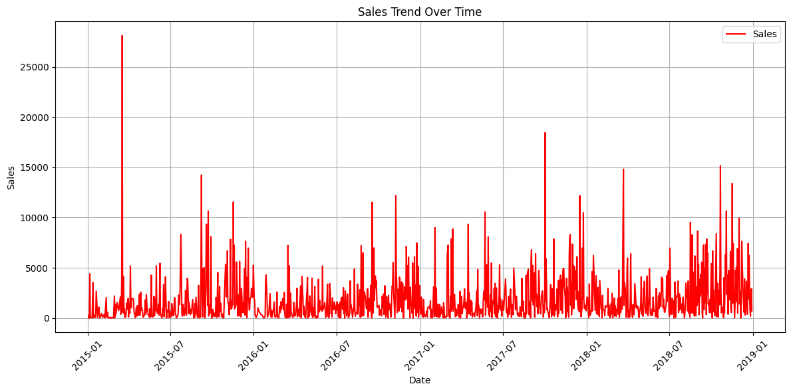
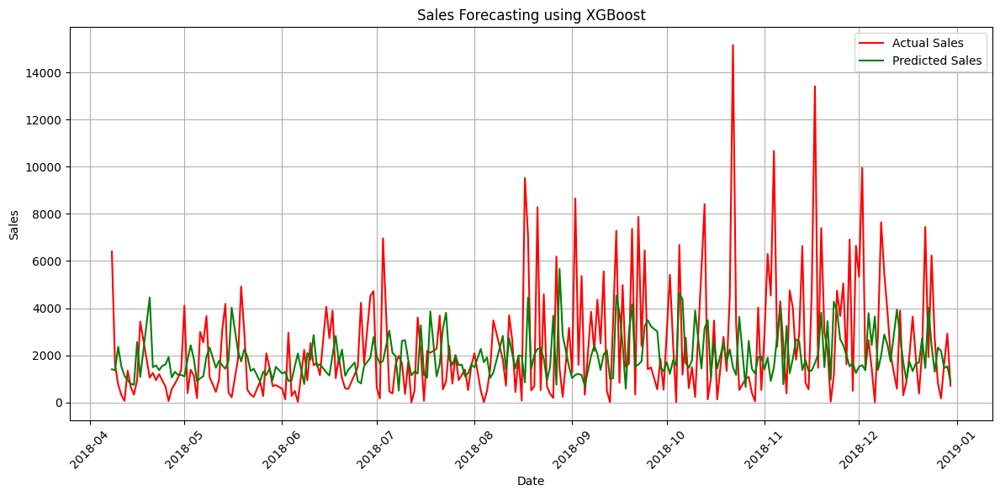

# Sales Forecasting with XGBoost

Forecasts **daily store sales** by framing time-series forecasting as a regression problem: the previous few days' sales become the input features, and an [XGBoost](https://xgboost.readthedocs.io/) gradient-boosted tree model learns to predict the next day's total from them.

## What it does

1. Loads the Superstore sales data (`train.csv`) and parses `Order Date` (day/month/year format).
2. Sums sales per day and plots the overall sales trend over time.
3. Builds **lag features** — `lag_1` … `lag_5`, the sales 1 to 5 days earlier — and drops the first few rows that don't have a full history.
4. Splits the data **chronologically** (no shuffling): the first 80% of the timeline trains, the most recent 20% tests.
5. Trains an XGBoost regressor (`n_estimators=100`, `learning_rate=0.1`, `max_depth=5`).
6. Predicts sales for the test period, reports **RMSE**, and plots actual vs. predicted sales.

## Concepts covered

- **Turning a time series into supervised learning** — tree models like XGBoost don't understand time on their own. Shifting the sales column by 1…N steps gives each row a fixed-size window of recent history, so a standard regressor can learn "given the last N days, what comes next?"
- **Lag features and the lost rows** — the first N rows have no complete history (their lags would be `NaN`), so they're dropped. More lags means more context but fewer usable rows.
- **Aggregating before lagging** — the raw file has one row *per order*, often many per day and not in date order. Lagging those rows would make `lag_1` mean "the previous order in the file", not "yesterday". Summing to one row per day and sorting by date first makes every lag a true time step. (Set `aggregate_by_date=False` in the config to reproduce the order-level version.)
- **Chronological train/test splitting** — `shuffle=False`-style splitting keeps the test period strictly after the training period, so the model is graded on a future it hasn't seen. A random split would leak future values into training through the lag features.
- **Gradient-boosted trees** — XGBoost builds many shallow decision trees in sequence, each correcting the errors of the previous ones. `learning_rate` controls how much each tree contributes and `max_depth` limits how complex each tree can get.
- **RMSE** — root mean squared error, in the same units as sales. Because errors are squared before averaging, it is pulled up strongly by a few large misses (such as days with unusually big orders).

## Project structure

```
main.py      # full pipeline, organized into functions (config, data loading,
              # daily aggregation, lag features, chronological split,
              # XGBoost training, evaluation, plotting)
README.md    # this file
```

The code is organized into small, named functions driven by a `PipelineConfig` dataclass — `load_data`, `daily_sales`, `build_series`, `create_lag_features`, `split_chronologically`, `train_xgboost`, `evaluate_model`, `plot_sales_trend`, `plot_predictions` — tied together by `run_pipeline()`.

Settings such as the number of lags, the test fraction and the XGBoost hyperparameters live in `PipelineConfig`, so you can experiment without touching the pipeline code:

```python
from main import PipelineConfig, run_pipeline

run_pipeline(PipelineConfig(n_lags=14, max_depth=3, n_estimators=300))
```

## Requirements

```
numpy
pandas
matplotlib
scikit-learn
xgboost
```

Install with:

```bash
pip install numpy pandas matplotlib scikit-learn xgboost
```

## How to run

Place the sales CSV (`train.csv`, with at least `Order Date` and `Sales` columns, e.g. the Superstore Sales dataset from Kaggle) in the same directory as `main.py`, then:

```bash
python main.py
```

## Sample output

Running the script prints the train/test sizes and the test-period RMSE, then displays two charts.

**Daily sales trend**



**Actual vs. predicted sales on the test period**



## A note on the results

Daily retail sales are very spiky: most days are modest, but a handful of large orders create sharp peaks. With only the last five days as input, the model has no information about *why* a spike happens (promotions, holidays, a big customer), so it tends to predict values near the recent average and miss the peaks — which is exactly what inflates RMSE. Natural next steps would be adding calendar features (day of week, month, holiday flags), rolling means and standard deviations, longer lag windows, or forecasting weekly totals, which are much smoother than daily ones.

## References

- [XGBoost documentation](https://xgboost.readthedocs.io/)
- [GeeksforGeeks — Machine Learning Projects](https://www.geeksforgeeks.org/machine-learning/machine-learning-projects/) — used as a general reference/inspiration while working on this project.

---
*This is a personal learning project. Forecasts from this model should not be used for real business decisions without further validation.*
